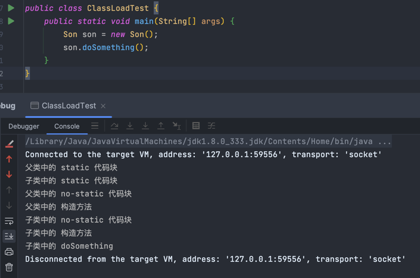

# 类的加载顺序
1. 父类的静态代码块
2. 子类的静态代码块
3. 父类代码块
4. 父类的构造方法
5. 子类代码块
6. 子类的构造方法



# 测试代码
[Parent.java](../../demo/model/Parent.java)

[Son.java](../../demo/model/Son.java)

[ClassLoadTest.java](../../demo/model/ClassLoadTest.java)

代码示例：
```java
public class Parent {
    static {
        System.out.println("父类中的 static 代码块");
    }
    {
        System.out.println("父类中的 no-static 代码块");
    }
    public Parent(){
        System.out.println("父类中的 构造方法");
    }

    public void doSomething(){
        System.out.println("父类中的 方法");
    }
}

public class Son extends Parent{
    static {
        System.out.println("子类中的 static 代码块");
    }
    {
        System.out.println("子类中的 no-static 代码块");
    }
    public Son(){
        System.out.println("子类中的 构造方法");
    }

    @Override
    public void doSomething() {
        System.out.println("子类中的 doSomething");
    }

}

public class ClassLoadTest {
    public static void main(String[] args) {
        Son son = new Son();
        son.doSomething();
    }
}

```