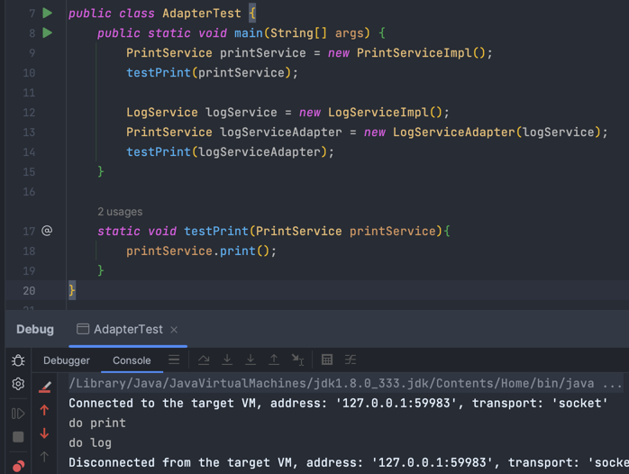

# 适配器模式示例：
租了一个新房子，给手机充电的时候发现墙上的插座是一个三孔的，怎么办，总不能把墙咋了重新装一个吧，大可不必。
这时候就可以网上买一个一转多的转换器，不仅有三孔的，还有两孔的，这个转换器就可以理解为适配器。
# 介绍
将一个接口转换成另一个接口，以符合客户的期望。
# 场景
现有一个软件系统，希望能和一个新的厂商的类库搭配使用，但是这个新厂商设计出来的接口跟旧厂商的接口不一样：

一个A系统，一个B系统，两个系统的接口不匹配，无法工作，在不改变现有代码的情况下，解决这个问题。

# 代码实现
两个用于打印服务接口，但是却不兼容
```java
public interface PrintService {
    void print();
}

public interface LogService {
    void log();
}
```
他们的实现分别是
```java
public class PrintServiceImpl implements PrintService {
    @Override
    public void print() {
        System.out.println("do print");
    }
}

public class LogServiceImpl implements LogService {
    @Override
    public void log() {
        System.out.println("do log");
    }
}
```
假设现在系统用的是`PrintService`,现在要使用新的`LogService`的接口。也就是要把`LogService`适配成`PrintService`一样去使用。

`PrintService`就相当于墙上的三孔插座，
`LogService`就相当于手机充电器，两孔的插销

那么新建一个适配器类，实现`PrintService`接口，持有`LogService`接口的实例。
```java
/**
 * 将LogService适配成PrintService
 * 相当于是一个插座转换器
 */
public class LogServiceAdapter implements PrintService {
    private LogService logService;

    public LogServiceAdapter(LogService logService){
        this.logService = logService;
    }
    @Override
    public void print() {
        logService.log();
    }
}
```
测试：
```java
public class AdapterTest {
    public static void main(String[] args) {
        PrintService printService = new PrintServiceImpl();
        testPrint(printService);
        
        LogService logService = new LogServiceImpl();
        PrintService logServiceAdapter = new LogServiceAdapter(logService);
        testPrint(logServiceAdapter);
    }

    static void testPrint(PrintService printService){
        printService.print();
    }
}
```
执行结果：

