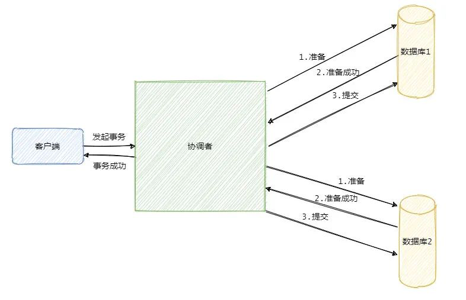

[参考链接](https://mp.weixin.qq.com/s/XknegP66mnYboiBx556Kzw)

# 两阶段提交/数据库XA
引入协调者，分准备阶段和提交阶段；
- 准备阶段：协调者发送准备命令给参与者，并同步等待所有参与者的响应
  > 除了不提交事务，其他的都做
- 提交阶段：如果收到所有参与者准备完毕，进入提交阶段；
  > 提交事务或回滚事务

# 三阶段提交3pc
