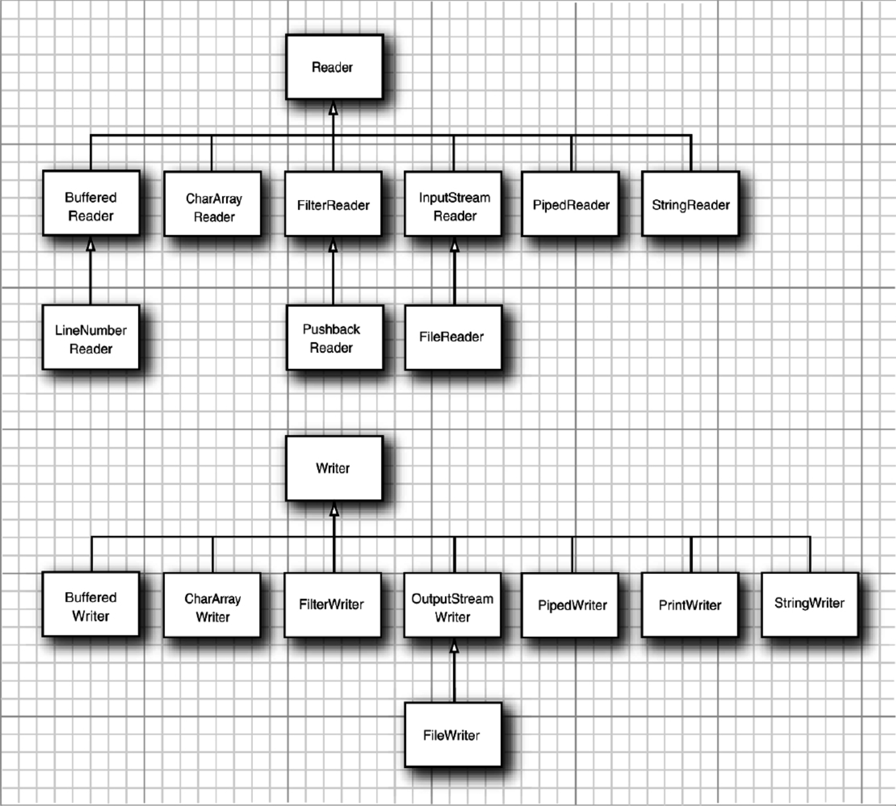

> https://snailclimb.gitee.io/javaguide/#/docs/java/io/io-basis

# 基础总结
> - 输入流：可以从其中读入一个字节序列的对象，称作输入流。
> - 输出流：可以从其中写入一个字节序列的对象，称作输出流。

## 字节流
可以读写单个字节和字节数组。

抽象类`InputStream`和`OutputStream`构成了输入/输出（I/O）类层次结构的基础。

`InputStream`和`OutputStream`的层次结构：

## 字符流
`Reader` 和 `Writer`的层次结构：

