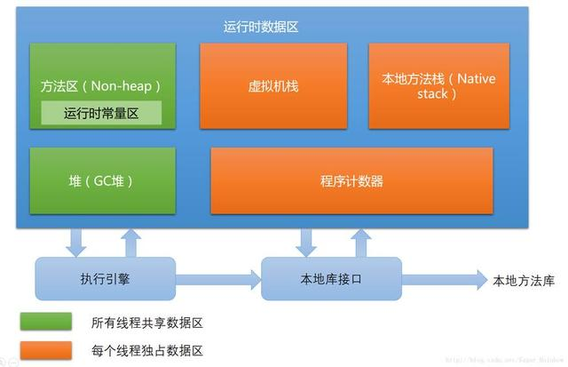
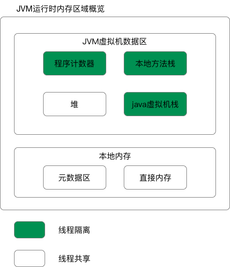

# 运行时数据区域

> Java虚拟机在执行Java程序的过程中会把它所管理的内存划分为若干个不同的数据区域。这些区域都有各自的用途，以及创建和销毁的时间，有的区域随着虚拟机进程的启动而存在，有些区域则依赖用户线程的启动和结束而建立和销毁。

> 根据《Java虚拟机规范（Java SE 7 版）》的规定，Java虚拟机所管理的内存将会包括以下几个运行时数据区域。

## 程序计数器
> 程序计数器是一块较小的内存空间，他可以看作是当前线程所执行的字节码的行号指示器。在虚拟机的概念模型里（`仅是概念模型，各种虚拟机可能会通过一些更高效的方式去实现`），字节码解释器工作时就是通过改变这个计数器的值来选取下一条需要执行的字节码指令，分支、循环、跳转、异常处理、线程恢复等基础功能都需要依赖这个计数器来完成。

> 由于Java虚拟机的多线程是通过线程轮流切换并分配处理器执行时间的方式来实现的，在任何一个确定的时刻，一个处理器（`对于多核处理器来说是一个内核`）都只会执行一条线程中的指令。因此，为了线程切换后能恢复到正确的执行位置，每条线程都需要有一个独立的程序计数器，各线程之间计数器互不影响，独立存储，我们称这类内存区域为“线程私有”的内存。

> 如果线程正在执行的是一个Java方法，这个计数器记录的是正在执行的虚拟机字节码指令的地址；如果正在执行的是Native方法，这个计数器值则为空（Undefined）。此内存区域是唯一一个在Java虚拟机规范中没有规定任何OutOfMemoryError情况的区域。
## Java虚拟机栈
> 与程序计数器一样，Java虚拟机栈也是线程私有的，它的生命周期和线程相同。
**虚拟机栈描述的是Java方法执行的内存模型：每个方法在执行的同时都会创建一个栈帧用于存储局部变量表、操作数栈、动态链接、方法出口等信息。** 每一个方法从调用直至执行完成的过程，就对应着一个栈帧在虚拟机栈中从入栈到出栈的过程。

> 大家常把Java分为堆内存和栈内存，这种分法比较粗糙。
**这里的“栈”就是现在所讲的虚拟机栈。** 或者说是虚拟机栈中局部变量表部分。

> **局部变量表**存放了编译期可知的各种基本数据类型（`boolean、byte、char、short、int、float、long、double`）、对象的引用（`refrence类型，它不等同于对象本身，可能是一个指向对象起始地址的引用指针，也可能是指向一个代表对象的句柄或其他与此对象相关的位置`）和returnAddress类型（`指向了一条字节码指令的地址`）。

在Java虚拟机规范中，对这个区域规定了两种异常状况：
> 如果线程请求的栈深度大于虚拟机所允许的深度，将抛出StackOverflowError异常；

> 如果虚拟机栈可以动态扩展（`当前大部分的Java虚拟机都可动态扩展，只不过Java虚拟机规范中也允许固定长度的虚拟机栈`），如果扩展时无法申请到足够的内存，就会抛出OutOfMemoryError异常。

## 本地方法栈
> 本地方法栈与虚拟机栈所发挥的作用是非常相似的，他们之间的区别不过是**虚拟机栈**为虚拟机执行Java方法（`也就是字节码`）服务，而本地方法栈则为虚拟机使用到的Native方法服务。

> 在虚拟机规范中对本地方法栈中方法使用的语言、使用方式与数据结构并没有强制规定，因此具体的虚拟机可以自由实现它。甚至有的虚拟机（`譬如Sun HotSpot虚拟机`）直接就把本地方法栈和虚拟机栈合二为一。

> **与虚拟机栈一样，本地方法栈也会抛出StackOverflowError和OutOfMemoryError异常。**

## Java 堆
> 对于大多数应用来说，**Java 堆是Java虚拟机所管理的内存中最大的一块。Java堆是被所有线程共享的一块内存区域，在虚拟机启动时创建。此内存区域的唯一目的就是存放对象实例，几乎所有的对象实例都在这里分配内存。** `这一点在Java虚拟机规范中的描述是：所有的对象实例以及数组都要在堆上分配，但是随着JIT编译器的发展与逃逸分析技术逐渐成熟，栈上分配、标量替换优化技术将会导致一些微妙的变化发生，所有的对象都分配在堆上也就渐渐变得不是那么“绝对”了。`

> Java堆是垃圾收集器管理的主要区域，因此很多时候也被称作“GC堆”。

> - 从内存回收的角度来看，由于现在收集器基本都采用分代收集算法,所以Java堆中还可以细分为：新生代和老年代；再细致一点的有Eden空间、From Survivor空间、To Surviror空间等。
> - 从内存分配的角度来看，线程共享的Java堆中可能划分出多个线程私有的分配缓冲区。不过无论如何划分，都与存放内容无关，无论哪个区域，存储的都仍然是对象实例，进一步划分的目的是为了更好的回收内存，或者更快的分配内存。

> 根据Java虚拟机规范的规定，Java堆可以处于物理上不连续的内存空间中，只要逻辑上是连续的即可，就像我们的磁盘空间一样。在实现时，既可以实现成固定大小的，也可以是可扩展的，不过当前主流的虚拟机都是按照可扩展来实现的（`通过-Xmx和-Xms控制`）。如果在堆中没有内存完成实例分配，并且堆也无法再扩展时，将会抛出OutOfMemoryError异常。

## 方法区
> 方法区与堆一样，是各个线程共享的内存区域，他用于存储已被虚拟机加载的类信息、常量、静态变量、即时编译器编译后的代码等数据。虽然Java虚拟机规范把方法区描述为堆的一个逻辑部分，但是他却有一个别名叫做**Non-Heap（非堆）**，目的应该是与Java堆区分开来。

> 对于习惯在HotSpot虚拟机上开发、部署程序的开发者来说，很多人都更愿意把方法区称为“**永久代**”，本质上两者并不等价，仅仅是因为HotSpot虚拟机的设计团队选择把GC分代收集扩展至方法区，或者说使用永久代来实现方法区而已，这样HotSpot的垃圾收集器可以像管理Java堆一样管理这部分内存，能够省去专门为方法区编写内存管理代码的工作。对于其他虚拟机（`如BEA JRockit、IBM J9等`）来说是不存在永久代的概念的。

> 原则上，如何实现方法区属于虚拟机实现细节，不受虚拟机规范约束，但使用永久代来实现方法区，现在看来并不是一个好主意，因为这样更容易遇到内存溢出问题（`永久代有-XX:MaxPermSize的上限，J9和JrockIT只要没有触碰到进程可用内存的上限，例如32位系统中的4GB，就不会出现问题`），而且有极少数方法（`如String.intern()`）会因为这个原因导致不同虚拟机下有不同的表现。因此，对于HotSpot虚拟机，根据官方发布的路线图信息，现在也有放弃永久代并逐步改为采用Native Memory来实现方法区的规划了，在目前已经发布的JDK1.7的HotSpot中，已经把原本放在永久代的**字符串常量池**移出。

Java虚拟机规范对方法区的限制非常宽松，除了和Java堆一样不需要连续的内存和可以选择固定大小或者可扩展外，还可以选择不实现垃圾收集。
> 相对而言，垃圾收集行为在这个区域是比较少出现的，但并非数据进入了方法区就如永久代的名字一样“永久”存在了。**这区域的内存回收目标主要是针对常量池的回收和对类型的卸载，** 一般来说，这个区域的回收“成绩”比较难以令人满意，尤其是类的卸载，条件相当苛刻，但是这部分区域的回收确实是必要的。在Sun公司的BUG列表中，曾出现过的若干个严重的BUG就是由于低版本的HotSpot虚拟机对此区域未完全回收而导致的内存泄漏。

> 根据Java虚拟机规范的规定，当方法区无法满足内存分配需求时，将抛出OutOfMemoryError异常。

# 其它的
## 运行时常量池
> 运行时常量池是**方法区的一部分** 。Class文件中除了有类的版本、字段、方法、接口等描述信息外，还有一项信息是常量池，用于存放编译期生成的各种字面量和符号引用，这部分内容将在类加载后进入方法区的运行时常量池中存放。

> 既然运行时常量池是方法区的一部分，自然受到方法区内存的限制，当常量池无法再申请到内存时会抛出OutOfMemoryError异常。

## 直接内存
> 直接内存（Direct Memory）并不是虚拟机运行时数据区的一部分，也不是Java虚拟机规范中定义的内存区域。但是这部分内存也被频繁地使用，而且也可能导致OutOfMemoryError异常出现，所以我们放到这里一起讲解。

> 在JDK 1.4中新加入了NIO（New Input/Output）类，引入了一种基于通道（Channel）与缓冲区（Buffer）的I/O 方式，它可以使用Native函数库直接分配堆外内存，然后通过一个存储在Java堆中的DirectByteBuffer对象作为这块内存的引用进行操作。这样能在一些场景中显著提高性能，因为避免了在Java堆和Native堆中来回复制数据。

> 显然，本机直接分配的内存不会受到Java堆大小的限制，但是，既然是内存，肯定还是会受到**本机总内存（`包括RAM以及SWAP区或者分页文件`）大小以及处理寻址空间**的限制。服务器管理员在配置虚拟机参数时，会根据实际内存设置-Xmx等参数信息，但经常忽略直接内存，使得各个区域总和大于物理内存限制（`包括物理的和操作系统级的限制`），从而导致动态扩展时出现OutOfMemoryError异常。

# 总结
| 数据区        | 数据类型                                                                                | 线程                                    | 特点                        |
|------------|-------------------------------------------------------------------------------------|---------------------------------------|---------------------------|
| 一、程序计数器    | 线程私有                                                                                |                                       |                           |
| 二、Java虚拟机栈 | 局部变量表、操组数栈、动态链接、方法出口等                                                               | 线程私有                                  | 为虚拟机执行Java方法（字节码）服务       |
| 局部变量表      | 编译期的基本数据类型、对象的引用、returnAddress类型（字节码指令的地址）                                          |                                       |                           |
| 三、本地方法栈    || 线程私有                                                                                | 为虚拟机使用到的Native方法服务                    |     |
| 四、堆        | 对象实例                                                                                | 线程共享                                  | 内存中最大的一块，虚拟机启动时创建         |
| 五、方法区      | 加载的类信息、常量、静态变量、编译后的代码等                                                              | 线程共享                                  | 堆的一个逻辑部分，内存回收主要针对常量池和类的卸载 |
| 运行时常量池     | 编译期生成的各种字面量和符号引用                                                                    || 方法区的一部分                               |     |
| 直接内存       | JDK 1.4新加入NIO，基于通道和缓冲区可以使用Native函数直接分配堆外内存，通过Java堆中的DirectByteBuffer对象作为这块内存的引用进行操作 || 某些场景中显著提高性能，避免了在Java堆和Native堆之间来回复制数据 |     |

# [JDK 8 - 废弃永久代](https://www.cnblogs.com/dennyzhangdd/p/6770188.html)
元空间的本质和永久代类似，都是对JVM规范中方法区的实现。不过元空间与永久代之间最大的区别在于：元数据空间并不在虚拟机中，而是使用本地内存

当年用永久代实现方法区并不是个好主意，这种设计导致了Java应用更容易遇到内存溢出的问题（永久代有-XX:MaxPermSize的上限，及时不设置也会有默认大小）；

而且有极少数方法（例如String::intern()）会因为永久代的原因而导致不同虚拟机下有不同的表现。

JDK 7时HotSpot已经把原本放在永久代的字符串常量池、静态变量等移除。

JDK 8时则直接完全废弃了永久代的概念，把JDK 7 中永久代还剩余的内容（主要是类型信息）全部移到了元空间中。

