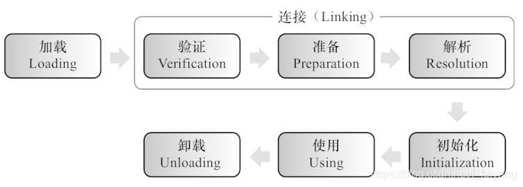
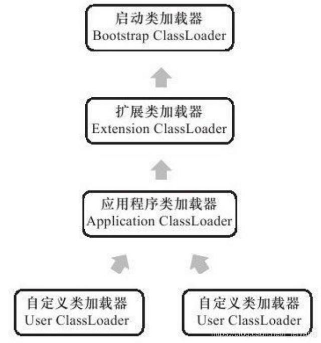

> 虚拟机把描述类的数据从Class文件加载到内存，并对数据进行校验、转换解析和初始化，最终形成可以被虚拟机直接使用的Java类型，这就是虚拟机的类加载机制。

Java里天生可以动态扩展的语言特性就是依赖运行期动态加载和动态连接这个特点实现的。

运行期间完成的
> 类的加载、连接和初始化过程
# 类加载的时机
> 类从被加载到虚拟机内存中开始，到卸载出内存为止，它的整个生命周期包括：
>> 加载(Loading)、验证（Verification）、准备（Preparation）、解析（Resolution）、初始化（Initialization）、使用（Using）和卸载（Unloading）7个阶段。

>> 其中，验证、准备、解析3个部分统称为**连接**（Linking）。

这7个阶段的发生顺序为：

加载、验证、准备、初始化和卸载这5个阶段的顺序是确定的，而解析阶段则不一定：它在某些情况下可以在初始化阶段之后再开始，这是为了支持Java语言的运行时绑定（也称为动态绑定或晚期绑定）。

# 类加载的过程
> Java虚拟机中类加载的全过程，也就是加载、验证、准备、解析和初始化这5个阶段所执行的具体动作。
## 加载
> 1. 通过一个类的全限定名来获取定义此类的二进制字节流。
> 2. 将这个字节流所代表的静态存储结构转化为方法区的运行时数据结构。
> 2. 在内存中生成一个代表这个类的java.lang.Class对象，作为方法区这个类的各种数据的访问入口。
## 验证
> 验证是连接阶段的第一步，这一阶段的目的是为了确保Class文件的字节流中包含的信息符合当前虚拟机的要求，并且不会危害虚拟机自身的安全。
> 1. 文件格式验证
> 2. 元数据验证
> 3. 字节码验证
> 4. 符号引用验证
## 准备
> 准备阶段是正式为类变量分配内存并设置类变量初始值的阶段，这些变量所使用的的内存都将在方法区中进行分配。
>>这时候进行内存分配的仅包括类变量`（被static修饰的变量）`，而不包括实例变量，实例变量将会在实例化时随着对象一起分配在Java堆中。

>>其次，这里所说的初始值“通常情况”下是数据类型的零值。

## 解析
> 解析阶段是虚拟机将常量池内的符号引用替换为直接引用的过程。

> 解析动作主要针对类或接口、字段、类方法、接口方法、方法类型、方法句柄和调用点限定符7类符号引用进行。
## 初始化
> 类初始化是类加载过程的最后一步，前面的类加载过程中，除了在加载阶段用户应用程序可以通过自定义类加载器参与之外，其余动作完全由虚拟机主导和控制。到了初始化阶段，才真正开始执行类中定义的Java程序代码（或者说字节码）。

# 类加载器的双亲委派机制
> 当一个类加载器接收到了类加载请求，他首先不会尝试自己去加载这个类，而是把这个请求委派给父类去完成，每一个层次的类加载器都是如此，因此所有的加载请求都应该传送到启动类加载器中。只有当父类加载器反馈自己无法完成这个请求的时候（在它的加载路径下没有找到所需加载的Class），子类加载器才会尝试自己去加载。

