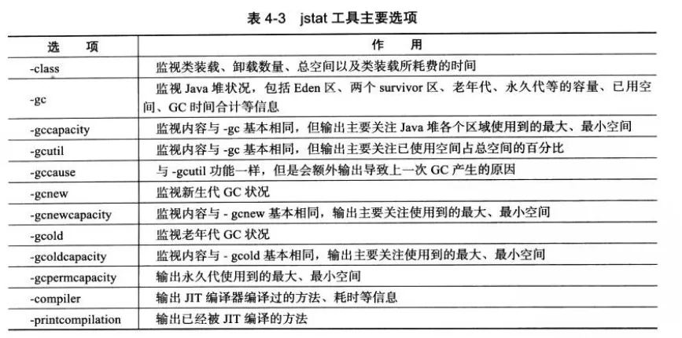

```
本地虚拟机唯一ID（LVMID）
操作系统的进程ID（PID）

如果是本地虚拟机进程，则LVMID与PID是一致的，命令中的 VMID与LVMID也是一致的
如果是远程虚拟机进程，则VMID格式为：
[protocol:][//]lvmid[@hostname[:port]/servername]
```
# jps：虚拟机进程状况工具
> 列出正在运行的虚拟机进程，并显示虚拟机执行主类名称以及这些进程的本地虚拟机唯一ID
```shell
jps [options] [hostid]
```
示例：
```shell
jps -l
```
| 选项  | 	作用                          |
|-----|------------------------------|
| -q	 | 只输出LVMID，省略主类的名称             |
| -m	 | 输出虚拟机进程，启动时传递给主类main()函数     |
| -l	 | 输出主类的全名，如果进程执行的是jar包，输出jar路径 |
| -v	 | 输出虚拟机进程启动时JVM参数              |

# jstat：虚拟机统计信息监视工具
用于监视虚拟机各种运行状态信息的命令行工具。
 
可以显示本地或者远程虚拟机进程中的类加载、内存、垃圾收集、即时编译等运行时数据。

```shell
jstat [option vmid [interval [s |ms] [count] ] ]
```
示例：每250毫秒查询一次进程274垃圾收集情况，一共查询20次：
```shell
jstat -gc 2764 250 20
```



# jinfo：Java配置信息工具
实时查看和调整虚拟机各项参数，
```shell
jinfo [option] pid
``` 
示例：查询`CMSInitiatingOccupancyFraction`参数值
```shell
jinfo -flag CMSInitiatingOccupancyFraction 1444
```
# jmap: Java内存映像工具
1. 用于生成堆转储快照（一般成为heapdump或dump文件）
2. 还可以查询`finalize`执行队列、Java堆和方法区的详细信息，如空间使用率、当前用的哪种收集器等。

```shell
jmap [option] vmid
```
# jhat：虚拟机堆转储快照分析工具
与jmap搭配使用，来分析jmap生成的堆转储快照。

基本上没人用：
> 1. 一般不会在应用服务器上分析堆转储快照，因为分析是一个耗时而且极为耗费硬件资源的过程。
> 2. 分析功能比较简陋，都在别的机器上了，当然可以用其他更好的工具了，如VisualVM,以及其他专业工具。

# jstack：Java堆栈跟踪工具
用于生成虚拟机当前时刻的线程快照（一般称为threaddump或者javacore文件）。

```shell
jstack [option] vmid
```
| 选项  | 作用                       |
|-----|--------------------------|
| -F  | 当正常输出的请求不被响应时，强制输出线程堆栈   |
| -l  | 除堆栈外，显示关于锁的附加信息          |
| -m  | 如果调用到本地方法的话，可以显示C/C++的堆栈 |


