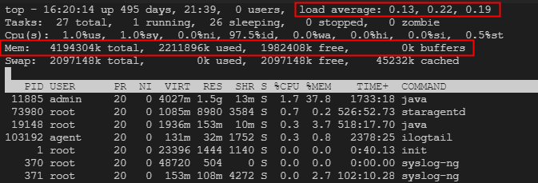
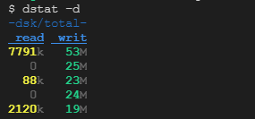

# 生产环境问题排查

[JDK内置工具使用（jps,jstack,jmap,jstat）](https://www.cnblogs.com/heishuichenzhou/p/10609085.html)

# 调优的一般流程

- `top`命令 查看CPU、内存占用情况
  

> load average：cpu在1分钟、5分钟、15分钟内的负载情况
> Mem: 内存的负载情况

- `dstat -d`观察机器的磁盘IO情况
  
- `dstat -r` 磁盘的读IOPS和写IOPS情况
- `dstat -n`网卡收发流量情况
- `jps` 查看应用进程编号pid
- `jmap -histo pid` 列出当前进程占内存最多的类和对象
- 通过业务逻辑去分析

# 调优常用推荐

阿里开源的 arthas,占用15%，一般不推荐使用，紧急的时候可以用

> 常用命令
>
> 1. `java -jar arthas-boot.jar` 启动
> 1. `dashboard` 查看面板，包括线程的CPU占用情况，收集器信息，运行时的信息
> 1. `thread` 查看所有线程的CPU占用情况

摘掉负载，浏量回放（运维），将dump下载下来进行分析

# 案例：

- [记一次生产环境CPU占用飙高问题解决](https://blog.csdn.net/BiLaHePan/article/details/50910583)
- [jstat jmap jstack命令使用 ](https://www.cnblogs.com/aspirant/p/7001082.html)