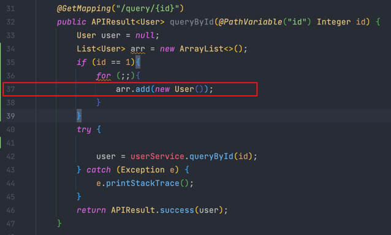
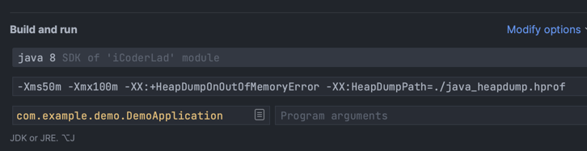
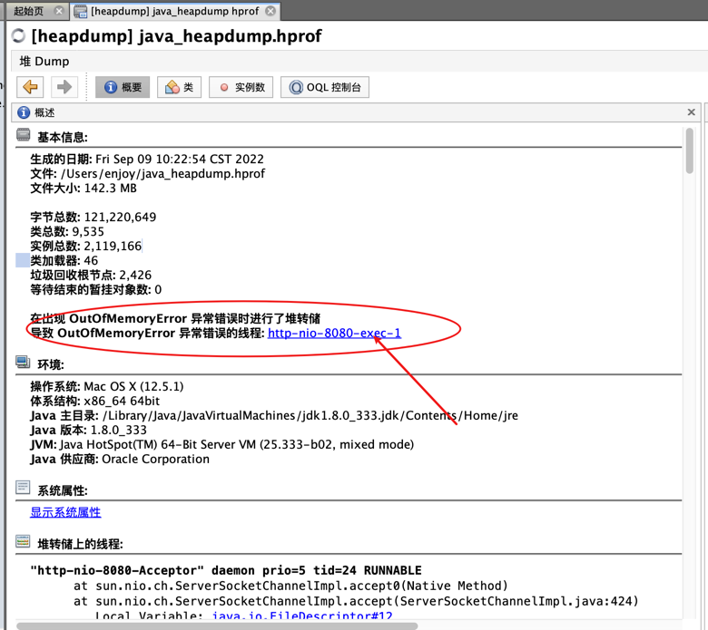
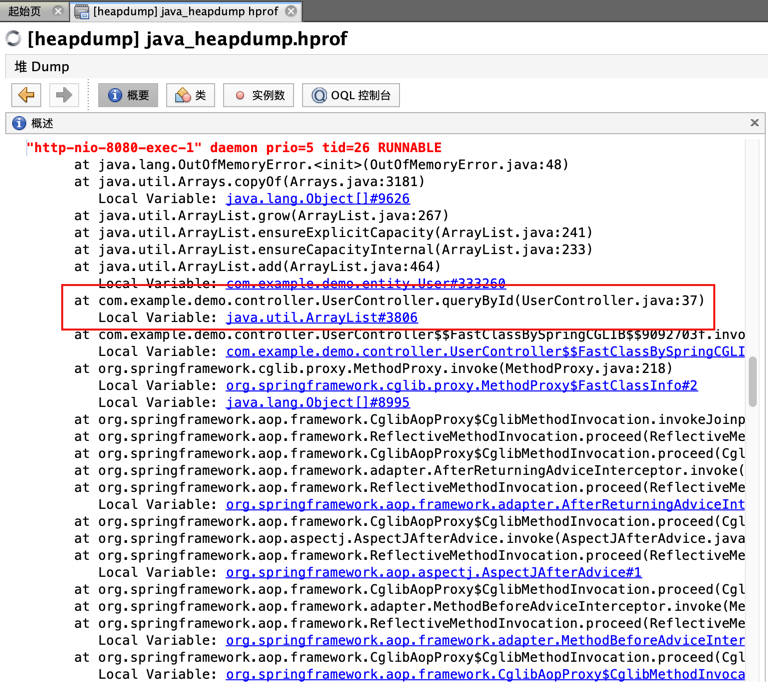

# 死循环创建大对象代码

# 调整JVM参数
```shell
-Xms50m 
-Xmx100m 
-XX:+HeapDumpOnOutOfMemoryError 
-XX:HeapDumpPath=./java_heapdump.hprof
```

# 测试
- 调用接口，会自动生成`java_heapdump.hprof`文件
- 终端输入命令：`jvisualvm`会启动jvisualvm
- 装入`java_heapdump.hprof`文件
- 


