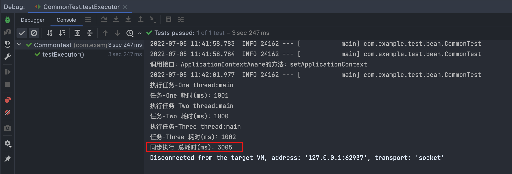
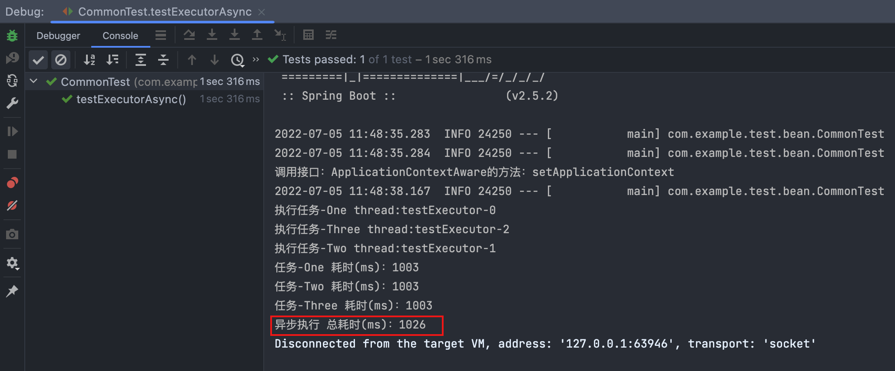

# 同步执行
## 代码示例
[CommonExecutor](../../demo/multithreading/async/CommonExecutor.java)

[TestMain](../../../../../../test/java/com/example/demo/multithreading/async/TestMain.java)
```java

@Component
public class CommonExecutor {

    public void doTaskOne() {
        doTask("One");
    }

    public void doTaskTwo() {
        doTask("Two");
    }


    public void doTaskThree() {
        doTask("Three");
    }

    private void doTask(String name) {
        System.out.println("执行任务-" + name + " thread:" + Thread.currentThread().getName());
        StopWatch stopwatch = new StopWatch("任务" + name);
        stopwatch.start();
        try {
            Thread.sleep(1000);
        } catch (InterruptedException e) {
            throw new RuntimeException(e);
        }
        stopwatch.stop();
        System.out.println("任务-" + name + " 耗时(ms)：" + stopwatch.getTotalTimeMillis());
    }

}

```
## 测试类
```java
@SpringBootTest
public class CommonTest {

    @Autowired
    private CommonExecutor commonExecutor;
    @Test
    public void testExecutor(){
        StopWatch stopwatch = new StopWatch("同步执行");
        stopwatch.start();
        commonExecutor.doTaskOne();
        commonExecutor.doTaskTwo();
        commonExecutor.doTaskThree();
        stopwatch.stop();
        System.out.println("同步执行 总耗时(ms)：" + stopwatch.getTotalTimeMillis());

    }

}
```
## 测试结果

# 异步执行
> 再来看一下使用异步优化后的执行效果

[CommonExecutorAsync](../../multithreading/async/CommonExecutorAsync.java)
 
[ExecutorThreadPool](../../multithreading/async/ExecutorThreadPool.java)

[TestMainAsync](../../../../../../../test/java/com/example/demo/multithreading/async/TestMainAsync.java)


## 代码示例

```java
@Component
public class CommonExecutorAsync {

    // 用指定的线程池
    @Async("testExecutor")
    public CompletableFuture<String> doTaskOne() {
        return doTask("One");
    }

    @Async("testExecutor")
    public CompletableFuture<String> doTaskTwo() {
        return doTask("Two");
    }


    @Async("testExecutor")
    public CompletableFuture<String> doTaskThree() {
        return doTask("Three");
    }

    private CompletableFuture<String> doTask(String name) {
        System.out.println("执行任务-" + name + " thread:" + Thread.currentThread().getName());
        StopWatch stopwatch = new StopWatch("任务" + name);
        stopwatch.start();
        try {
            Thread.sleep(1000);
        } catch (InterruptedException e) {
            throw new RuntimeException(e);
        }
        stopwatch.stop();
        System.out.println("任务-" + name + " 耗时(ms)：" + stopwatch.getTotalTimeMillis());
        return CompletableFuture.completedFuture("任务" + name + "完成");
    }

}
```
## 定义线程池
```java
@Configuration
public class ExecutorThreadPool {
    @Bean("testExecutor")
    public ExecutorService executorService() {
        return new ThreadPoolExecutor(4, 10, 5, TimeUnit.SECONDS,
                new SynchronousQueue<>(), new ThreadFactoryBuilder().setNameFormat("testExecutor-%d").build());
    }
}
```
## 测试类
```java
@EnableAsync //允许开启异步的注解
@SpringBootTest
public class CommonTest {
    @Autowired
    private CommonExecutorAsync commonExecutorAsync;

    @Test
    public void testExecutorAsync(){
        StopWatch stopwatch = new StopWatch("异步执行");
        stopwatch.start();
        CompletableFuture<String> aFuture = commonExecutorAsync.doTaskOne();
        CompletableFuture<String> bFuture = commonExecutorAsync.doTaskTwo();
        CompletableFuture<String> cFuture = commonExecutorAsync.doTaskThree();
        CompletableFuture.allOf(aFuture,bFuture,cFuture).join();
        stopwatch.stop();
        System.out.println("异步执行 总耗时(ms)：" + stopwatch.getTotalTimeMillis());

    }

}
```
## 测试结果

