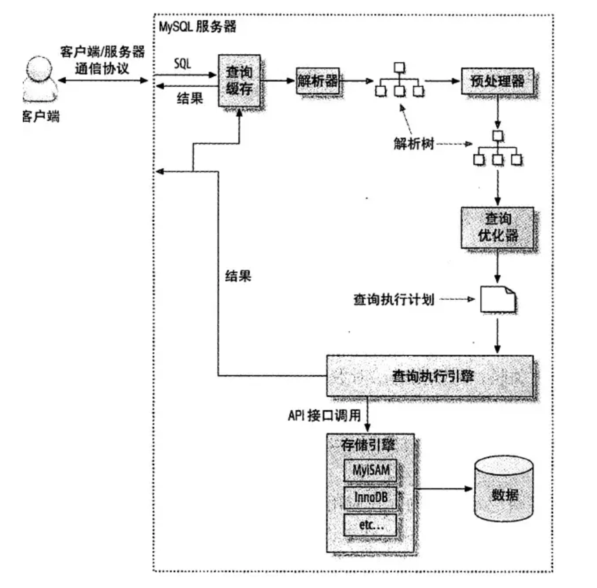

# 为什么查询速度会慢
查询性能低下的最基本原因是访问的数据太多。
大部分性能低下的查询都可以通过减少访问的数据量的方式进行优化。

对于低效的查询，两个有效的分析步骤：
1. 确认应用程序是否在检索大量超过需要的数据。这通常意味着访问了太多的行，但有时候也可能是访问了太多的列。
2. 确认MySQL服务器是否存在分析大量超过需要的数据行。
## 慢查询基础：优化数据访问
### 是否请求了不需要的数据
- 查询不需要的记录
- 多表关联时返回全部列
- 总是取出全部列
- 重复查询相同的数据
### 是否存在扫描额外的记录
最简单的衡量查询开销的三个指标：
- 响应时间
- 扫描的行数
- 返回的行数

这三个指标会记录在MySQL的慢查询日志中。检查慢查询日志是找出扫描行数过多的查询的好办法。
## 重构查询的方式
- 一个复杂查询还是多个简单查询
- 切分查询
  > 一个大的查询还是多个小的查询
- 分解关联查询
  > 优势：
  > - 让缓存的效率更高。
  > - 将查询分解后，执行单个查询可以减少锁的竞争。
  > - 在应用层做关联，可以更容易的对数据库进行拆分，可以更容易做到高性能和高扩展。
  > - 查询本身的效率也有可能提升。（使用`IN()`代替关联查询可让MySQL按照ID顺序进行查询，这可能比随机的关联更高效）。
  > - 可以减少冗余记录的查询
  > - 这样做相当于在应用中实现了哈希关联而不是MySQL的嵌套循环关联。某些场景中哈希关联的效率要高很多
## 查询执行的基础
查询执行路径：

1. 客户端先发送一条查询给服务器。
2. 服务器先检查查询缓存，如果命中缓存，则立即返回存储在缓存中的结果。否则进入下一阶段。
3. 服务端进行SQL解析、预处理，再由优化器生成对应的执行计划。
4. MySQL根据优化器生成的执行计划，调用存储引擎的API来执行查询。
5. 将结果返回给客户端。
