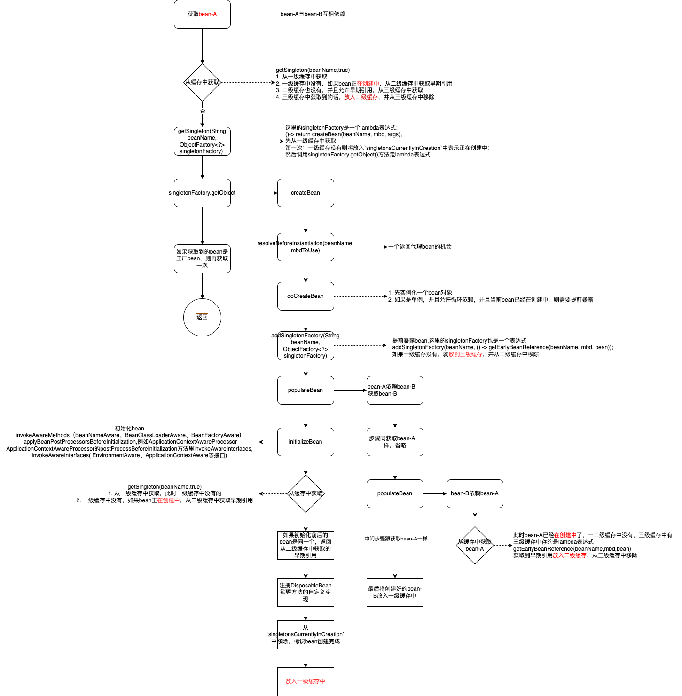
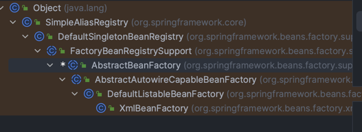

# bean生命周期的定义
`BeanFactory`中定义了bean的标准生命周期
`org.springframework.beans.factory.BeanFactory`
```java
Bean factory implementations should support the standard bean lifecycle interfaces as far as possible. The full set of initialization methods and their standard order is:
    1. BeanNameAware's setBeanName
    2. BeanClassLoaderAware's setBeanClassLoader
    3. BeanFactoryAware's setBeanFactory
    4. EnvironmentAware's setEnvironment
    5. EmbeddedValueResolverAware's setEmbeddedValueResolver
    6. ResourceLoaderAware's setResourceLoader (only applicable when running in an application context)
    7. ApplicationEventPublisherAware's setApplicationEventPublisher (only applicable when running in an application context)
    8. MessageSourceAware's setMessageSource (only applicable when running in an application context)
    9. ApplicationContextAware's setApplicationContext (only applicable when running in an application context)
    10. ServletContextAware's setServletContext (only applicable when running in a web application context)
    11. postProcessBeforeInitialization methods of BeanPostProcessors
    12. InitializingBean's afterPropertiesSet
    13. a custom init-method definition
    14. postProcessAfterInitialization methods of BeanPostProcessors
On shutdown of a bean factory, the following lifecycle methods apply:
    1. postProcessBeforeDestruction methods of DestructionAwareBeanPostProcessors
    2. DisposableBean's destroy
    3. a custom destroy-method definition
```


# 从 `AbstractBeanFactory#getBean`说起

```java
    @Override
	public Object getBean(String name) throws BeansException {
		return doGetBean(name, null, null, false);
	}
    
	protected <T> T doGetBean(
			String name, @Nullable Class<T> requiredType, @Nullable Object[] args, boolean typeCheckOnly)
			throws BeansException {
        // <1> name可能是工厂bean的名字（以&开头），也可能是alias别名，所以要进行转换
		String beanName = transformedBeanName(name);
		Object beanInstance;

		// <2> 先查询缓存
		Object sharedInstance = getSingleton(beanName);
		if (sharedInstance != null && args == null) {
			//略。。。
                        // 缓存中有，会走这里
			beanInstance = getObjectForBeanInstance(sharedInstance, name, beanName, null);
		}

		else {
			        // 省略。。。
        
				// 默认是单例的
				if (mbd.isSingleton()) {
                                    // 调用 getSingleton(String beanName, ObjectFactory<?> singletonFactory)
                                    // singletonFactory的getObject()是个lambda表达式,相当于直接调用createBean()
					sharedInstance = getSingleton(beanName, () -> {
						try {
							return createBean(beanName, mbd, args);
						}
						catch (BeansException ex) {
							// Explicitly remove instance from singleton cache: It might have been put there
							// eagerly by the creation process, to allow for circular reference resolution.
							// Also remove any beans that received a temporary reference to the bean.
							destroySingleton(beanName);
							throw ex;
						}
					});
                                        // 如果是工厂bean（FactoryBean）的话，再获取一次
					beanInstance = getObjectForBeanInstance(sharedInstance, name, beanName, mbd);
				}

				// 略。。。
		}

		return adaptBeanInstance(name, beanInstance, requiredType);
	}

```


## getSingleton-1
`DefaultSingletonBeanRegistry`类中的方法
```java
    @Override
	@Nullable
	public Object getSingleton(String beanName) {
		return getSingleton(beanName, true);
	}
```

## getSingleton-2
`DefaultSingletonBeanRegistry`类中的方法
1. 先从一级缓存中取
2. 一级缓存没有则将放入`singletonsCurrentlyInCreation`中表示正在创建中；
3. 调用`singletonFactory`的getObject()方法创建早期引用的bean，因为这里传入的是个lambda表达式，实际上就是调用`createBean`方法；
4. 从`singletonsCurrentlyInCreation`中移除
5. 将创建好的bean加入到一级缓存中，并从二级和三级缓存中移除
```java
	public Object getSingleton(String beanName, ObjectFactory<?> singletonFactory) {
		Assert.notNull(beanName, "Bean name must not be null");
		synchronized (this.singletonObjects) {
			Object singletonObject = this.singletonObjects.get(beanName);
			if (singletonObject == null) {
				if (this.singletonsCurrentlyInDestruction) {
					throw new BeanCreationNotAllowedException(beanName,
							"Singleton bean creation not allowed while singletons of this factory are in destruction " +
							"(Do not request a bean from a BeanFactory in a destroy method implementation!)");
				}
				if (logger.isDebugEnabled()) {
					logger.debug("Creating shared instance of singleton bean '" + beanName + "'");
				}
                                // 一级缓存没有则将放入`singletonsCurrentlyInCreation`中表示正在创建中；
				beforeSingletonCreation(beanName);
				boolean newSingleton = false;
				boolean recordSuppressedExceptions = (this.suppressedExceptions == null);
				if (recordSuppressedExceptions) {
					this.suppressedExceptions = new LinkedHashSet<>();
				}
				try {
                    // 创建一个早期引用的bean
					singletonObject = singletonFactory.getObject();
					newSingleton = true;
				}
				catch (IllegalStateException ex) {
					// Has the singleton object implicitly appeared in the meantime ->
					// if yes, proceed with it since the exception indicates that state.
					singletonObject = this.singletonObjects.get(beanName);
					if (singletonObject == null) {
						throw ex;
					}
				}
				catch (BeanCreationException ex) {
					if (recordSuppressedExceptions) {
						for (Exception suppressedException : this.suppressedExceptions) {
							ex.addRelatedCause(suppressedException);
						}
					}
					throw ex;
				}
				finally {
					if (recordSuppressedExceptions) {
						this.suppressedExceptions = null;
					}
                                        // 创建完毕从`singletonsCurrentlyInCreation`中移除；
					afterSingletonCreation(beanName);
				}
				if (newSingleton) {
                                        // cache1:创建成功，放入一级缓存中，并从二级和三级缓存中移除
					addSingleton(beanName, singletonObject);
				}
			}
			return singletonObject;
		}
	}
```
## cache1-addSingleton
放入一级缓存中，并从二级缓存和三级缓存中移除
```java
	protected void addSingleton(String beanName, Object singletonObject) {
		synchronized (this.singletonObjects) {
			this.singletonObjects.put(beanName, singletonObject);
			this.singletonFactories.remove(beanName);
			this.earlySingletonObjects.remove(beanName);
			this.registeredSingletons.add(beanName);
		}
	}
```
## cache2-getSingleton
1. 从一级缓存中获取
2. 一级缓存中没有，如果bean正在创建中，从二级缓存中获取早期引用
3. 二级缓存也没有，并且允许早期引用，从三级缓存中获取
4. 三级缓存中获取到，放入二级缓存，并从三级缓存中移除
```java
	protected Object getSingleton(String beanName, boolean allowEarlyReference) {
		// 先看下一级缓存里是否已经存在创建好的bean
		Object singletonObject = this.singletonObjects.get(beanName);
		if (singletonObject == null && isSingletonCurrentlyInCreation(beanName)) {
                        // 看二级缓存里有没有
			singletonObject = this.earlySingletonObjects.get(beanName);
			if (singletonObject == null && allowEarlyReference) {
				synchronized (this.singletonObjects) {
					// double check lock
					singletonObject = this.singletonObjects.get(beanName);
					if (singletonObject == null) {
                                                // 从二级缓存中取
						singletonObject = this.earlySingletonObjects.get(beanName);
						if (singletonObject == null) {
                                                        // 一级二级缓存中都没有，看三级缓存中是否有
							ObjectFactory<?> singletonFactory = this.singletonFactories.get(beanName);
							if (singletonFactory != null) {
                                                                // 通过getObject()方法，实际上走lambda函数调用getEarlyBeanReference(beanName, mbd, bean)
								singletonObject = singletonFactory.getObject();
								this.earlySingletonObjects.put(beanName, singletonObject);
								this.singletonFactories.remove(beanName);
							}
						}
					}
				}
			}
		}
		return singletonObject;
	}
```
## cache3-addSingletonFactory
放入到三级缓存中，并从二级缓存中移除
```java
	protected void addSingletonFactory(String beanName, ObjectFactory<?> singletonFactory) {
		Assert.notNull(singletonFactory, "Singleton factory must not be null");
		synchronized (this.singletonObjects) {
			if (!this.singletonObjects.containsKey(beanName)) {
				this.singletonFactories.put(beanName, singletonFactory);
				this.earlySingletonObjects.remove(beanName);
				this.registeredSingletons.add(beanName);
			}
		}
	}
```

# createBean
```java
    @Override
	protected Object createBean(String beanName, RootBeanDefinition mbd, @Nullable Object[] args)
			throws BeanCreationException {

		if (logger.isTraceEnabled()) {
			logger.trace("Creating instance of bean '" + beanName + "'");
		}
		RootBeanDefinition mbdToUse = mbd;

		// Make sure bean class is actually resolved at this point, and
		// clone the bean definition in case of a dynamically resolved Class
		// which cannot be stored in the shared merged bean definition.
		Class<?> resolvedClass = resolveBeanClass(mbd, beanName);
		if (resolvedClass != null && !mbd.hasBeanClass() && mbd.getBeanClassName() != null) {
			mbdToUse = new RootBeanDefinition(mbd);
			mbdToUse.setBeanClass(resolvedClass);
		}

		// Prepare method overrides.
		try {
			mbdToUse.prepareMethodOverrides();
		}
		catch (BeanDefinitionValidationException ex) {
			throw new BeanDefinitionStoreException(mbdToUse.getResourceDescription(),
					beanName, "Validation of method overrides failed", ex);
		}

		try {
			// Give BeanPostProcessors a chance to return a proxy instead of the target bean instance.
                        // 给后处理器一个返回代理bean的机会
			Object bean = resolveBeforeInstantiation(beanName, mbdToUse);
			if (bean != null) {
				return bean;
			}
		}
		catch (Throwable ex) {
			throw new BeanCreationException(mbdToUse.getResourceDescription(), beanName,
					"BeanPostProcessor before instantiation of bean failed", ex);
		}

		try {
                        // 去创建bean
			Object beanInstance = doCreateBean(beanName, mbdToUse, args);
			if (logger.isTraceEnabled()) {
				logger.trace("Finished creating instance of bean '" + beanName + "'");
			}
			return beanInstance;
		}
		catch (BeanCreationException | ImplicitlyAppearedSingletonException ex) {
			// A previously detected exception with proper bean creation context already,
			// or illegal singleton state to be communicated up to DefaultSingletonBeanRegistry.
			throw ex;
		}
		catch (Throwable ex) {
			throw new BeanCreationException(
					mbdToUse.getResourceDescription(), beanName, "Unexpected exception during bean creation", ex);
		}
	}
```

# doCreateBean
```java
	protected Object doCreateBean(String beanName, RootBeanDefinition mbd, @Nullable Object[] args)
			throws BeanCreationException {

		// 实例化一个bean
		BeanWrapper instanceWrapper = null;
		if (mbd.isSingleton()) {
			instanceWrapper = this.factoryBeanInstanceCache.remove(beanName);
		}
		if (instanceWrapper == null) {
			instanceWrapper = createBeanInstance(beanName, mbd, args);
		}
		Object bean = instanceWrapper.getWrappedInstance();
		Class<?> beanType = instanceWrapper.getWrappedClass();
		if (beanType != NullBean.class) {
			mbd.resolvedTargetType = beanType;
		}

		// Allow post-processors to modify the merged bean definition.
		synchronized (mbd.postProcessingLock) {
			if (!mbd.postProcessed) {
				try {
					applyMergedBeanDefinitionPostProcessors(mbd, beanType, beanName);
				}
				catch (Throwable ex) {
					throw new BeanCreationException(mbd.getResourceDescription(), beanName,
							"Post-processing of merged bean definition failed", ex);
				}
				mbd.postProcessed = true;
			}
		}

		// Eagerly cache singletons to be able to resolve circular references
		// even when triggered by lifecycle interfaces like BeanFactoryAware.
                // 如果是单例，并且允许循环依赖，并且当前bean已经在创建中，则需要提前暴露
		boolean earlySingletonExposure = (mbd.isSingleton() && this.allowCircularReferences &&
				isSingletonCurrentlyInCreation(beanName));
		if (earlySingletonExposure) {
			if (logger.isTraceEnabled()) {
				logger.trace("Eagerly caching bean '" + beanName +
						"' to allow for resolving potential circular references");
			}
                        // cache3: 提前暴露bean，将创建早期引用的bean的创建工厂放入三级缓存
			addSingletonFactory(beanName, () -> getEarlyBeanReference(beanName, mbd, bean));
		}

		// Initialize the bean instance.
                // 初始化bean的实例
		Object exposedObject = bean;
		try {
                        // 填充bean属性
			populateBean(beanName, mbd, instanceWrapper);
                        // 初始化 invokeAwareMethods（BeanNameAware、BeanClassLoaderAware、BeanFactoryAware）
                        // applyBeanPostProcessorsBeforeInitialization,例如ApplicationContextAwareProcessor
                        // ApplicationContextAwareProcessor的postProcessBeforeInitialization方法里invokeAwareInterfaces,
                        // invokeAwareInterfaces看是否实现了 EnvironmentAware、ApplicationContextAware等接口
			exposedObject = initializeBean(beanName, exposedObject, mbd);
		}
		catch (Throwable ex) {
			if (ex instanceof BeanCreationException && beanName.equals(((BeanCreationException) ex).getBeanName())) {
				throw (BeanCreationException) ex;
			}
			else {
				throw new BeanCreationException(
						mbd.getResourceDescription(), beanName, "Initialization of bean failed", ex);
			}
		}

		if (earlySingletonExposure) {
                        // cache2:如果已经提前暴露（已经放入三级缓存），这里从一级和二级缓存中取，不涉及三级缓存
			Object earlySingletonReference = getSingleton(beanName, false);
			if (earlySingletonReference != null) {
				if (exposedObject == bean) {
					exposedObject = earlySingletonReference;
				}
				else if (!this.allowRawInjectionDespiteWrapping && hasDependentBean(beanName)) {
					String[] dependentBeans = getDependentBeans(beanName);
					Set<String> actualDependentBeans = new LinkedHashSet<>(dependentBeans.length);
					for (String dependentBean : dependentBeans) {
						if (!removeSingletonIfCreatedForTypeCheckOnly(dependentBean)) {
							actualDependentBeans.add(dependentBean);
						}
					}
					if (!actualDependentBeans.isEmpty()) {
						throw new BeanCurrentlyInCreationException(beanName,
								"Bean with name '" + beanName + "' has been injected into other beans [" +
								StringUtils.collectionToCommaDelimitedString(actualDependentBeans) +
								"] in its raw version as part of a circular reference, but has eventually been " +
								"wrapped. This means that said other beans do not use the final version of the " +
								"bean. This is often the result of over-eager type matching - consider using " +
								"'getBeanNamesForType' with the 'allowEagerInit' flag turned off, for example.");
					}
				}
			}
		}

		// Register bean as disposable.
		try {
                        // DisposableBean 自定义实现销毁方法
			registerDisposableBeanIfNecessary(beanName, bean, mbd);
		}
		catch (BeanDefinitionValidationException ex) {
			throw new BeanCreationException(
					mbd.getResourceDescription(), beanName, "Invalid destruction signature", ex);
		}

		return exposedObject;
	}
```

