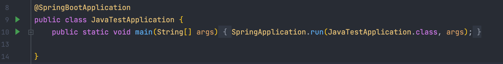
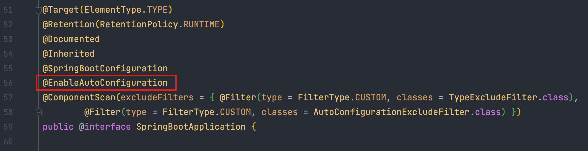
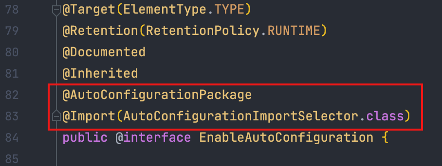
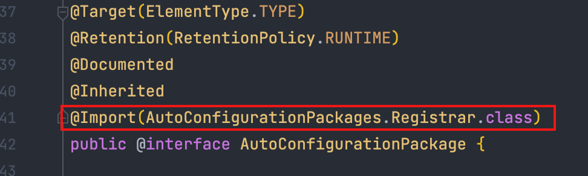
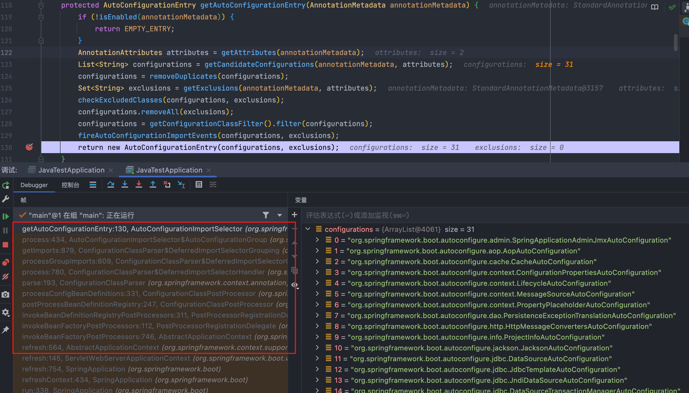
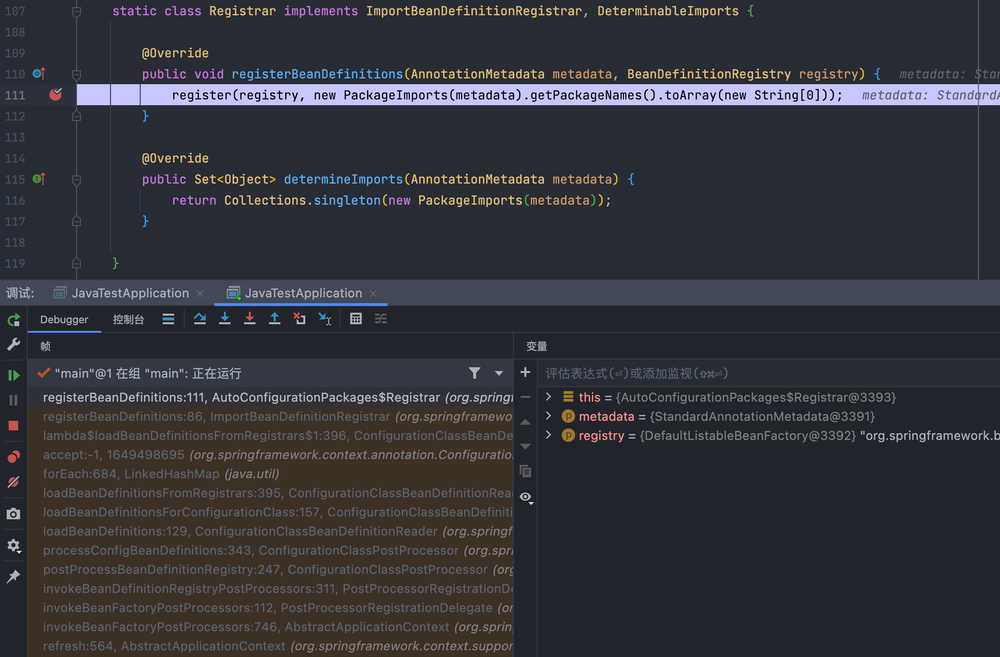
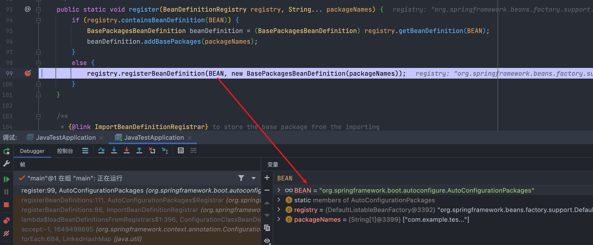
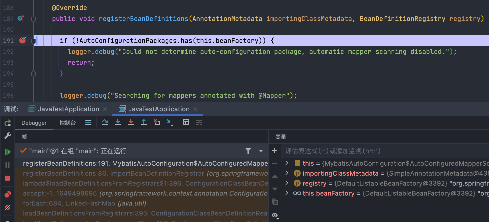
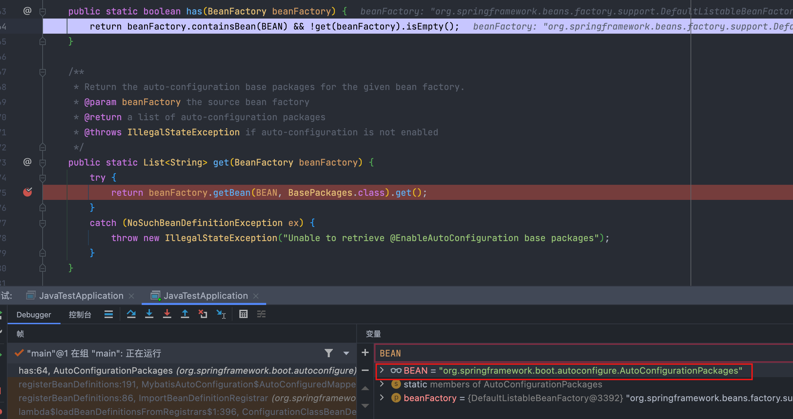
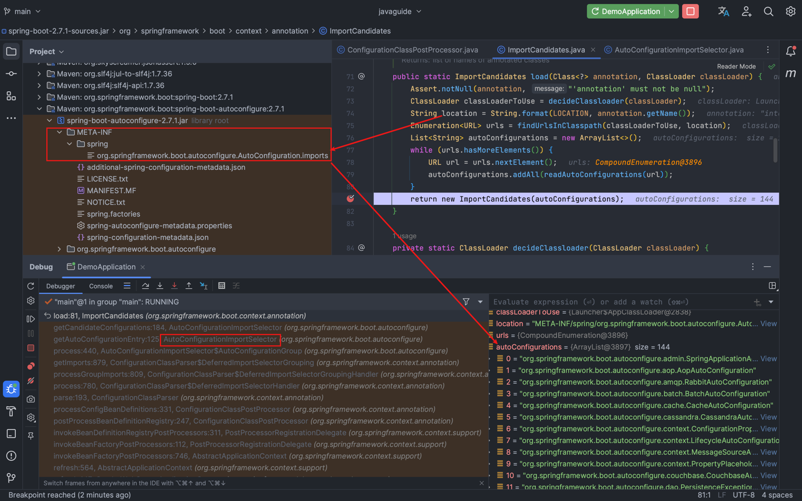

SpringBoot版本如下：
```xml
    <parent>
        <groupId>org.springframework.boot</groupId>
        <artifactId>spring-boot-starter-parent</artifactId>
        <version>2.5.2</version>
        <relativePath/> <!-- lookup parent from repository -->
    </parent>
```

**启动类**
Springboot项目的配置只需在启动类使用`SpringBootApplication` 注解即可



# 相关注解说明
## SpringBootApplication
`SpringBootApplication` 是一个组合注解，指示声明一个或多个@Bean方法并触发自动化配置和组件扫描，
相当于`@Configuration`、`@EnableAutoConfiguration` 和`@ComponentScan`。
这里只关注自动化配置-->`@EnableAutoConfiguration`



## EnableAutoConfiguration
`EnableAutoConfiguration` 也是一个组合注解，相当于向Spring容器中导入了两个bean,
`AutoConfigurationImportSelector`和`AutoConfigurationPackages.Registrar`



## AutoConfigurationPackage
该注解引入了`AutoConfigurationPackages.Registrar`,



# 自动化配置原理--执行流程
## AutoConfigurationImportSelector
在`getAutoConfigurationEntry` 方法中默认读取`META-INF/spring.factories`中的所有自动化配置，过滤掉不生效的（根据`@ConditionalOnClass`、`OnBeanConditional`、`OnWebApplicationConditional`）
```java
	protected AutoConfigurationEntry getAutoConfigurationEntry(AnnotationMetadata annotationMetadata) {
		if (!isEnabled(annotationMetadata)) {
			return EMPTY_ENTRY;
		}
		AnnotationAttributes attributes = getAttributes(annotationMetadata);
                // 返回位于 META-INF/spring/%s.imports文件中的自动配置类名称,
		List<String> configurations = getCandidateConfigurations(annotationMetadata, attributes);
		configurations = removeDuplicates(configurations);
		Set<String> exclusions = getExclusions(annotationMetadata, attributes);
		checkExcludedClasses(configurations, exclusions);
		configurations.removeAll(exclusions);
		configurations = getConfigurationClassFilter().filter(configurations);
                // 返回位于 META-INF/spring.factories 文件中的自动配置类名称
		fireAutoConfigurationImportEvents(configurations, exclusions);
		return new AutoConfigurationEntry(configurations, exclusions);
	}
```

## AutoConfigurationPackages.Registrar
`AutoConfigurationPackages.Registrar`类会将`AutoConfigurationPackages`注册到Spring容器中;
作用是：
使用了SpringBoot自动化配置的框架，比如：Mybatis，在配置初始化的时候通过判断是否存在这个自动化配置bean来决定是否自动扫描mapper
`BEAN=org.springframework.boot.autoconfigure.AutoConfigurationPackages`




# Mybatis自动化配置示例
Mybatis自动配置类`MybatisAutoConfiguration`中通过判断是否存在这个自动化配置bean来决定是否自动扫描mapper
`BEAN=org.springframework.boot.autoconfigure.AutoConfigurationPackages`




# 装配最开始执行的入口
从3.0之后自动配置将彻底放弃`META-INF/spring.factories`
使用`META-INF/spring/org.springframework.boot.autoconfigure.AutoConfiguration.imports`的配置方式代替
[注意：Spring Boot 2.7开始spring.factories不推荐使用了](https://www.yht7.com/news/190710)


